# 1stProject
A dataset of 10,000 bank customers containing demographic, financial, and engagement details used to analyze patterns and drivers of customer churn.

## Bank-Churn-Analysis-Dashboard

### Dashboard Link : https://github.com/Masoom0112/1stProject/blob/6bf40949f6aeef99e9de7c9336d36f554f8f3f84/Bank_Churn_Dashboard.pdf

# Problem Statement

Customer churn directly impacts revenue and long-term growth.
The bank wants to understand:

- How severe the churn problem is
- Which regions and customer segments are most affected
- Whether high-value or financially reliable customers are at risk
- Where to focus retention efforts

### Dataset Link : https://github.com/Masoom0112/1stProject/blob/b6013e416c0fc94c287163dc7658ade2effc01c0/Bank_Churn.csv
### Dataset Dictionary Link : https://github.com/Masoom0112/1stProject/blob/2fd6e9bcfaf2bb24c358c2691ad6763af5374530/Bank_Churn_Data_Dictionary.csv

## Tool Used

- Power BI Desktop
- Power Query Editor

# Steps followed 

- Step 1 : Load data into Power BI Desktop, dataset is a csv file.
- Step 2 : Open power query editor & in view tab under Data preview section, check "column distribution", "column quality" & "column profile" options.
- Step 3 : Also since by default, profile will be opened only for 1000 rows so you need to select "column profiling based on entire dataset".
- Step 4 : It was observed that in none of the columns errors & empty values were present.
- Step 5 : Inspect every column individually.
  
              Verify:
                (a) Missing values
                (b) Errors
                (c) Data types
                (d) Outliers
   
- Step 6 : In PowerQuery Editor, new columns were added under 'add column' section using 'custom column' in which, customers were grouped into various groups:

                   (a) Age Group
                   (b) Salary Band
                   (c) Credit Score Bins
                   (d) Balance Groups
     
- Step 7 : Custom Column formula for 'Age Group':

        Table.AddColumn(#"Added Custom", "Age Group", each if [Age] <= 25 then "18-25"
        else if [Age] <= 35 then "26-35"
        else if [Age] <= 45 then "36-45"
        else if [Age] <= 55 then "46-55"
        else "55+")
   Snap of new calculated column;

    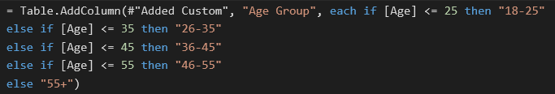
   
- Step 8 : Custom Column formula for 'Salary Band':

        Table.AddColumn(#"Added Conditional Column1", "SalaryBand", each if [EstimatedSalary] < 50000 then "Low (<50K)"
        else if [EstimatedSalary] < 100000 then "Mid (50K–100K)"
        else if [EstimatedSalary] < 150000 then "High (100K–150K)"
        else "Very High (150K+)")
  
   Snap of new calculated column;

    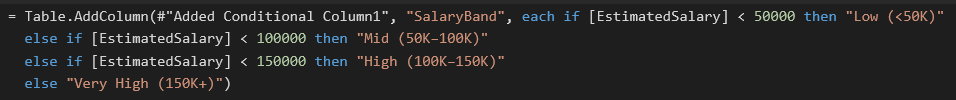

- Step 9 : Custom Column formula for 'Credit Score Bins':

       Table.AddColumn(#"Changed Type2", "Credit Score Bins", each if [CreditScore] < 580 then "Poor"
       else if [CreditScore] < 670 then "Fair"
       else if [CreditScore] < 740 then "Good"
       else "Excellent ")

    Snap of new calculated column;

    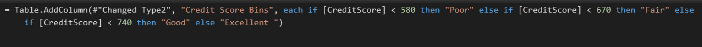
  
- Step 10 : Custom Column formula for 'Balance Groups':

       Table.AddColumn(#"Replaced Value3", "Balance Groups", each if [Balance] >= 100000 then "High"
       else if [Balance] >= 50000 then "Medium"
       else if [Balance] = 0 then "Zero Balance"
       else "Low")

   Snap of new calculated column;

  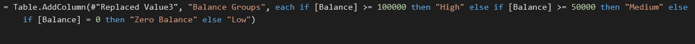
  
- Step 11 : A new table was created namely 'Measured Table' to to separate mearuses from other columns.
- Step 12 : Following measures were created:

              (a) Churn Rate
              (b) Churned Customers
              (c) Active Members
              (d) Inactive Members
              (e) Average Credit Score(CHURNED)
              (f) Average Credit Score(RETAINED)
              (g) Don'tHaveCreditCard
              (h) HaveCreditCard
  
- Step 13 : DAX expression for 'Churn Rate':

      Churn Rate = DIVIDE(SUM(Bank_Churn[Exited]),COUNT(Bank_Churn[CustomerId]))*100

  Snap of new DAX measure;

    
  
- Step 14 : DAX expression for 'Churned Customers':

      Churned Customers = SUM(Bank_Churn[Exited])

   Snap of new DAX measure;

    

- Step 15 : DAX expression for 'Active Members':

      Active Members = CALCULATE(COUNTROWS(Bank_Churn),Bank_Churn[IsActiveMember] = "Yes" )

   Snap of new DAX measure;

    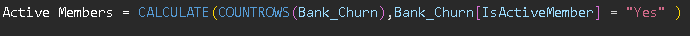

- Step 16 : DAX expression for 'Inactive Members':

      Inactive Members = CALCULATE(COUNTROWS(Bank_Churn),Bank_Churn[IsActiveMember] = "No" )

   Snap of new DAX measure;

    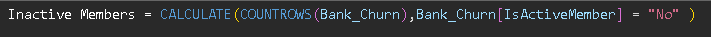

- Step 17 : DAX expression for 'Average Credit Score(CHURNED)':

      Average Credit Score(CHURNED) = CALCULATE(AVERAGE(Bank_Churn[CreditScore]),Bank_Churn[Exited] = 1)

   Snap of new DAX measure;

    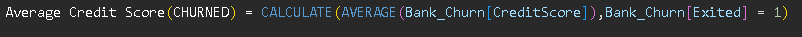

- Step 18 : DAX expression for 'Average Credit Score(RETAINED)':

      Average Credit Score(RETAINED) = CALCULATE(AVERAGE(Bank_Churn[CreditScore]),Bank_Churn[Exited] = 0)

   Snap of new DAX measure;

    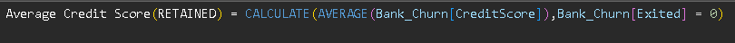

- Step 19 : DAX expression for 'Don'tHaveCreditCard':

      Don'tHaveCreditCard = CALCULATE('Measure Table'[Churn Rate],Bank_Churn[HasCrCard]= "No")

   Snap of new DAX measure;

    

- Step 20 : DAX expression for 'HaveCreditCard':

      HaveCreditCard = CALCULATE('Measure Table'[Churn Rate],Bank_Churn[HasCrCard]= "Yes")

   Snap of new DAX measure;

    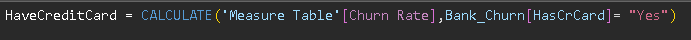

- Step 21 : The dashboard is divided into two pages and the titles were added to both pages:

          (a) Customer Churn Overview
          (b) Churn Drivers & Segments
  
- Step 22 : The following card visuals were added:

      * Page 1 -

         (a) Churn Rate
  
     

         (b) Churned Customers
  
     
  
         (c) Active Members
  
     
  
         (d) Inactive Members
  
     
  
         (e) Average Credit Score(CHURNED)

     
  
         (f) Average Credit Score(RETAINED)

     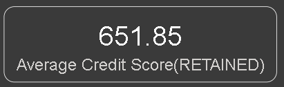
  
         (g) Total Customers

     
  

      * Page 2 -

         (a) Don'tHaveCreditCard

     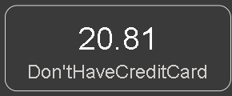
  
         (b) HaveCreditCard

     
  

- Step 23 : The following slicers were added:

      * Page 1 -

         (a) Geography
  
     
  
         (b) Gender

     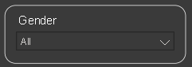
  
     
      * Page 2 -

         (a) Geography

     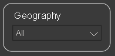
  
         (b) Gender

     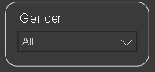
  
         (c) Age Group

     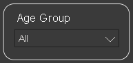
  
         (d) Credit Score Bins

     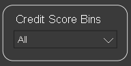
  
         (e) IsActiveMember

     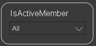
  

- Step 24 : The following visuals were added:

      * Page 1 -

         (a) Churn Rate by Tenure
              - Line Chart

     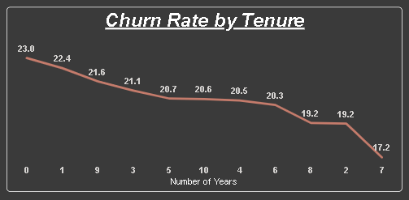
  
         (b) Churn Rate by Active Involvement
              - Donut Chart

     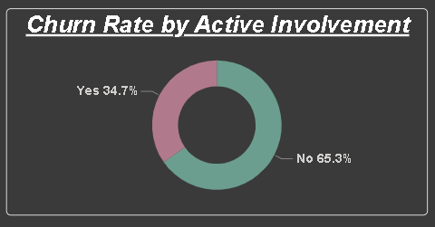
  
         (c) Churn Rate by Gender
              - Bar Chart
  
     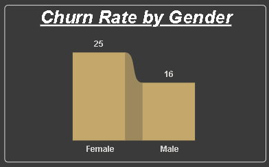
  
         (d) Churn Rate by Region
              - Map

     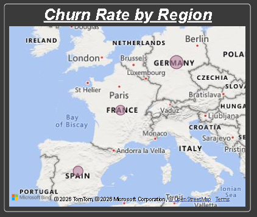
  

      * Page 2 -

         (a) Churn Rate by Balance Group
              - Funnel Chart

     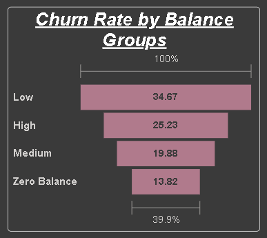
  
         (b) Churn Rate by Number of Products
              - Bar Chart

     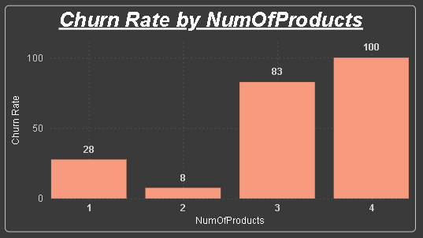
  
         (c) Churn Rate by Credit Score Bins
              - Donut Chart

     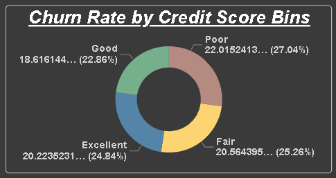
  
         (d) Churn Rate by Age Group
              - Bar Chart

     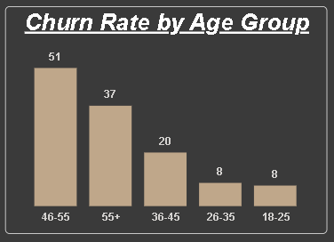
  
         (e) Churn Rate by Salary Band
              - Funnel Chart

     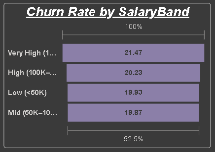
  
  
- Step 25 : After completing data cleaning, data modeling, DAX calculations, and dashboard design, the Power BI report file (.pbix) was saved.
- Step 26 : Before exporting, all visuals, KPI cards, slicers, and charts were verified to ensure that the dashboard displayed the correct information and insights.
- Step 27 : Navigate to:

                   File → Export → Export to PDF

     Power BI generated a PDF version of the dashboard containing all report visuals and insights.
- Step 28 :The exported PDF was reviewed to ensure that:

   -All visuals were displayed correctly.
  
   -Text and labels were clearly visible.
  
   -Dashboard layout was maintained.
  
   -No charts or KPI cards were cut off during export.
  

# Insights

 - There were a total of 10000 customers records in this dataset among which 2037 customers exited the bank. When calculated the churn rate came out to around 20%.
 - Germany shows the highest churn rate among all regions,i.e, around 32%, with a significantly higher churn rate compared to France (~15%) and Spain (~ 16%).Therefore this difference indicates towards a region-specific churn issue.
 - Customers who are not active members exhibit a significantly higher churn rate compared to active members by a difference of almost 14% in churn rate.this suggests that customer engagement is a major contributor to overall churn, and likely plays a key role in explaining churn patterns observed across regions.
 - Customers aged 40 and above(around 35-55%) exhibit a higher churn rate compared to younger age groups, indicating a clear age-related churn pattern which also aligns with the observation with activity status, as a larger proportion of inactive customers fall within the 40+ age group, suggesting a strong relationship between age, engagement, and churn.
 - Customers in the low but non-zero account balance group exhibit the highest churn rate, exceeding both zero-balance and higher-balance segments with second highest being the highest-balance group, which raises a business concern.
 - Customers in the lowest credit score band exhibit the highest churn rate, while churn differences across higher credit score bands are relatively modest.
 - The average credit scores of churned and retained customers are relatively similar, suggesting that credit score alone is not a strong indicator of customer churn.
 - Female customers exhibit a higher churn rate compared to male customers, suggesting an opportunity for the bank to further investigate customer experience, product preferences, and engagement strategies within this segment.
 - Customers holding multiple products generally show stronger retention.
 - Credit card ownership appears to have minimal impact on customer churn, as churn rates remain relatively similar for customers with and without a credit card.
 - Since there is no significante difference in churn rate by balance, high-balance customers being valuable to the bank, so reducing churn in this group should be a key priority.

# Recommendations

 - Deeper investigation into customer behavior and potential regional factors.
 - Focus churn-reduction initiatives in high-risk regions.
 - Develop retention programs for inactive customers.
 - Monitor high-risk segments continuously.

   

